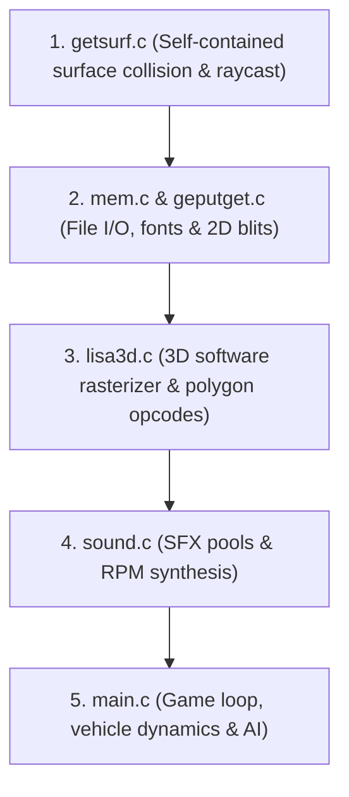

# Ignition (1997) Master Decompilation Plan (DOS Target)

This document establishes the official engineering plan, memory architecture, tooling pipeline, and module sequence for the 1:1 decompilation of **Ignition** (1997, Unique Development Studios / Virgin Interactive), targeting the 32-bit DOS executable (`MAINDOS.EXE`).

---

## 1. Core Philosophy: Decompile First, Port Second

To eliminate cognitive overhead and context switching, all active modernization/SDL porting work has been frozen on `master`. Decompilation proceeds on the dedicated **`decomp`** branch with two strict phases:

1. **Phase A (The Re-creation)**: Recover functionally faithful structured C89 from authentic MAINDOS.EXE, built with Open Watcom V2 and validated in equivalent DOSBox scenarios. Optional normalized instruction matching is diagnostic and does not establish functional completion.
2. **Phase B (The Modernization)**: Once complete and verified against the original binary, port the clean C codebase to modern platforms (C11, SDL2, 64-bit).

---

## 2. Target Binary & Memory Architecture

### Authentic LE analysis

`Ignition/Ignition/MAINDOS.EXE` is the exclusive source of truth. Never convert, replace, or overwrite it. The obsolete PE repackaging workflow lost initializers and ABI information and is prohibited.

Use `tools/le_parser.py` to recover LE objects and apply relocations in memory, `tools/disasm_le.py` for bounded instruction inspection, and `tools/verify_capstone.py` for authentic instructions and data. File offsets are determined from the LE object/page tables, not assumed PE section offsets.

The authentic LE parser reports these objects:

| Object | Linear base | Virtual size | Stored bytes |
| --- | --- | --- | --- |
| Code | `0x10000` | `0x75c4f` | 482383 |
| Read-only data | `0x90000` | `0x1597` | 5527 |
| Data/BSS | `0xa0000` | `0x1cf640` | 291734 |

Unstored BSS, initialized pages, pointer fixups, and packed tables require separate interpretation. Do not assume a zero-filled reconstruction is authentic without binary evidence.

Build/symbol verification uses `uv run python tools/verify_matching.py`. Instruction comparison remains optional via `--strict`. Tracking/annotation validation uses `uv run python tools/verify_fidelity.py`; it reports gaps and does not certify game behavior. See `docs/tracking/implementation_inventory.md` and `runtime_baseline.md` for source evidence and observed runtime limits.

---

## 3. SQLite Decompilation Tracking System

Tracking has migrated from manual markdown tables to a centralized, relational SQLite database.

### Files
* **Database File**: `database/decomp.db`
* **Schema Definition**: `database/schema.sql`
* **Version-Controlled Dump**: `database/dump.sql` (text diffable in git)
* **CLI Interface**: `tools/db.py`

### Schema Architecture
* **`modules`**: Translation units (`getsurf.c`, `lisa3d.c`, `geputget.c`, `mem.c`, `main.c`, `sound.c`).
* **`functions`**: Dual-addressing scheme:
  * `dos_address`: Primary address in `MAINDOS.EXE` (e.g. `0x0002004c`).
  * `win_address`: Cross-reference address in `MAINDOS.EXE` (e.g. `0x00412670`).
  * `calling_convention`: Watcom register (`watcom_reg`: `eax`, `edx`, `ebx`, `ecx`), `cdecl`.
  * `status`: `unidentified` $\rightarrow$ `analyzed` $\rightarrow$ `decompiled` $\rightarrow$ `matching`.
* **`globals`**: Global variables, buffers, and tables mapped to addresses and types.
* **`structs`** & **`struct_fields`**: Reconstructed C structs with exact byte offsets.
* **`deviations`**: Bug workarounds and authentic quirk registry.

### CLI Workflow (`tools/db.py`)
```bash
# View current decompilation status and module completion
uv run python tools/db.py status

# Link an identified DOS address to its Windows counterpart
uv run python tools/db.py link 0x00412670 0x0002004c

# Update function status
uv run python tools/db.py set-status 0x0002004c matching

# Add a newly discovered DOS function
uv run python tools/db.py add-func 0x0002004c Surface_LoadSRF getsurf.c --purpose "Loads .SRF track surface"

# Export back to human-readable markdown
uv run python tools/db.py export-markdown

# Dump database to git-tracked SQL
uv run python tools/db.py dump-sql
```

---

## 4. Anchor Functions & Authentic Naming

`MAINDOS.EXE` contains intact assert strings and Swedish developer debug logs that reveal the authentic 1997 source filenames, function names, line numbers, and object types:

1. **`getsurf.c`**:
   * String: `d:\projects\ignition\getsurf\getsurf.c` (at `0x000a7cf4`)
   * Asserts: `pFile != NULL` (line 222), `x == 1`
   * Anchor Function: **`Surface_LoadSRF` @ `0x0002004C`** (corresponds to `MAINDOS.EXE @ 0x00412670`)
2. **`lisa3d.c`**:
   * Swedish Error Logs: `FEL VID LI_MOVEOBJECT`, `LI_PLACEOBJECT`, `LI_HIDEOBJECT`
   * Identifies Lisa 2 3D Development System engine functions: `Li_MoveObject`, `Li_PlaceObject`, `Li_HideObject`
   * Object types: `HANDLE PLOT`, `SLADD OBJ 1` (skid/slide), `HANDLE SHADOW`, `LIGHTENING`, `HANDLE CAR`, `WEATHER`, `WATER SPLASH`, `FLYING PARTS`
   * String: `Lisa 2 Development System` $\rightarrow$ `Lisa_Init` / `Lisa_PrintVersion`
3. **`mem.c`**:
   * Memory allocators, buffer initialization, file loading
4. **`geputget.c`**:
   * 2D blitter, `.PIC` image decoders, `.LFT` font renderer
5. **`main.c`**:
   * String: `CARS\TEST.AIS` $\rightarrow$ AI spline and navigation path loader
   * Master state loop, 72 Hz physics tick, camera basis calculation

---

## 5. Module-by-Module Decompilation Sequence

Decompilation is ordered strictly from fewest dependencies to most complex:



### Module 1: `getsurf.c` (Estimated ~15 functions)
* `Surface_LoadSRF` (`0x0002004c`)
* `Surface_FreeSRF`
* `Surface_GetCell`
* `Surface_GetTriangleHeight`
* `Surface_Raycast`
* `Surface_CalculateNormal`

### Module 2: `mem.c` & `geputget.c` (Estimated ~25 functions)
* `File_LoadToMemory`
* `Font_Load` & `Font_DrawText`
* `Pic_Decode` & `Palette_Set`

### Module 3: `lisa3d.c` (Estimated ~50 functions)
* Rasterizer initialization: `Lisa_Init`, `Lisa_InitEngineMemory`, `Lisa_InitOpcodeTable`
* Scene transformation: `Lisa_FrustumCullObjects`, `Lisa_TransformVertices`
* Polygon opcodes: `Opcode 0x11` (textured), `0x12` (color key cutout), `0x13` (shadow blend), `0x15` (perspective textured), `0x16` (perspective cutout), `0x17` (shadow Gouraud)
* Depth bucketing: 6,000 bins sorting and span dispatcher

### Module 4: `sound.c` (Estimated ~20 functions)
* Pool loaders: `ROLL`, `SKID`, `COLL`, `BOOST`, `DIV`, `KLICK`, `OK`
* `ENGINE.INF` 800-byte curve lookup arrays for vehicle acoustics

### Module 5: `main.c` (Estimated ~60 functions)
* `Game_StateDispatcher`
* Vehicle physics integration (72 Hz timestep, `21.76` scale factor, slope clamping)
* AI waypoint navigation along `.TRI` chunks and splines
* Dynamic chase camera

---

## 6. Decompilation Workspace Structure (`decomp/`)

Source files for Phase A will reside in a dedicated vintage source tree:

```text
decomp/
├── include/
│   ├── getsurf.h
│   ├── lisa3d.h
│   ├── geputget.h
│   ├── mem.h
│   ├── sound.h
│   ├── main.h
│   └── types.h
└── src/
    ├── getsurf.c
    ├── lisa3d.c
    ├── geputget.c
    ├── mem.c
    ├── sound.c
    └── main.c
```

---

## 7. Toolchain & Verification Pipeline

1. **Ghidra Analysis**:
   * Open `Ignition/Ignition/MAINDOS.EXE` in Ghidra CodeBrowser.
   * Auto-analysis detects 32-bit x86 PE with entry point `0x00055FBC`.
2. **Decompilation**:
   * Decompile function in Ghidra at its `dos_address`.
   * Reconstruct clean C in `decomp/src/<module>.c`.
3. **Compilation**:
   * Compile using Watcom C/C++ 10.6 (`wcc386 -3r -omaxet -s`).
4. **Binary Diffing**:
   * Verify assembly output against `MAINDOS.EXE`.
5. **Status Update**:
   * Update `database/decomp.db` via `python tools/db.py set-status <addr> matching`.
   * Run `python tools/db.py dump-sql` and commit.
