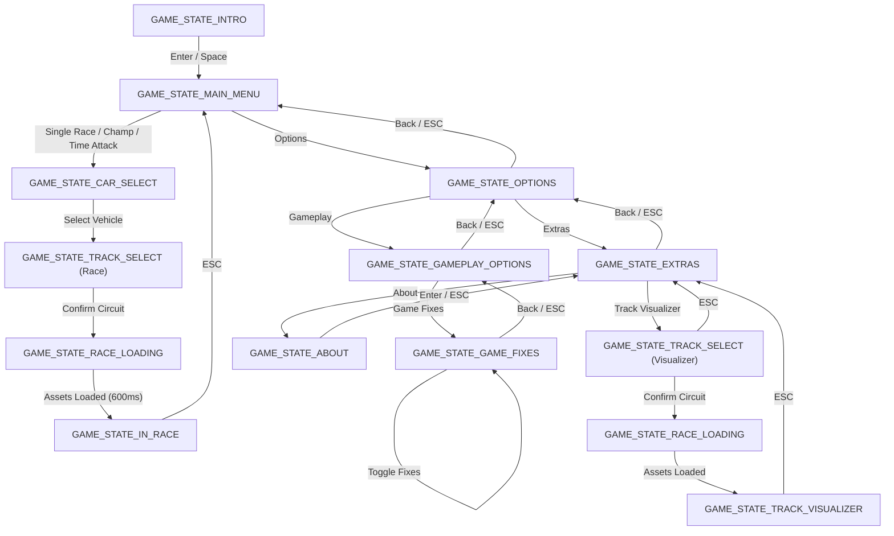

# Ignition Game Loop & State Machine

## 1. Top-Level Entry & Execution Flow

The Windows 95 executable initializes CRT startup at `entry` (`0x00469950`), acquires the module instance, and calls `WinMain` (`0x004120a0`).

```
+-------------------------------------------------------------+
|               entry (CRT Startup: 0x00469950)               |
+-------------------------------------------------------------+
                               |
                               v
+-------------------------------------------------------------+
|                     WinMain (0x004120a0)                    |
| - Registers "Ignition" window class                         |
| - Queries performance timer (QueryPerformanceFrequency)     |
| - App_Init (0x00412500): Creates window, DirectDraw/Input   |
+-------------------------------------------------------------+
                               |
                               v
               +-------------------------------+
               |      Message / Tick Loop      |
               | PeekMessage / GetMessage      |
               +-------------------------------+
                               | (No OS messages)
                               v
+-------------------------------------------------------------+
|                App_FrameTick (0x00412230)                   |
| - State 0: Game Init (0x00417270) -> switches to State 1    |
| - State 1: Active Game Dispatcher (0x004172b0)              |
| - State 2: Shutdown & Cleanup (0x00417e90)                  |
+-------------------------------------------------------------+
```

---

## 2. Main Game Dispatcher (`FUN_004172b0`)

The main game state machine is governed by global control flags in `FUN_004172b0`:

### Primary State Flags

| Variable | Address | Description |
| :--- | :--- | :--- |
| `g_GameStage` | `0x00493734` | Master game stage (`0` = Init, `1` = Active, `2` = Exit/Shutdown). |
| `g_IntroState` | `0x00639394` | Intro logos sequence (`2` = Virgin/UDS logos, `1` = Initialize menus, `0` = Done). |
| `g_MenuState` | `0x00563c3c` | Menu active flag (`1` = Rendering & processing menu inputs via `FUN_00402c00`). |
| `g_MenuSelected` | `0x00563d9c` | Menu item selected (`1` = Process menu selection via `FUN_004038f0`). |
| `g_RaceLoadStage`| `0x00553290` | Race loading sequence (`1` $\rightarrow$ `2` $\rightarrow$ `3` $\rightarrow$ `0`). |
| `g_InRace` | `0x00525e5c` | Active race simulation (`1` = In-race vehicle simulation & 3D rendering). |

---

## 3. State Machine Transitions

```
[Start Engine]
      |
      v
g_GameStage = 0  --> FUN_00417270() initializes defaults, sets g_IntroState = 2
      |
      v
g_IntroState = 2 --> FUN_004182d0() displays Virgin & UDS company logos
      |
      v
g_IntroState = 1 --> FUN_004029a0() initializes menu data, sets g_MenuState = 1
      |
      v
g_MenuState = 1  --> FUN_00402c00() runs interactive menus (single race, championship, options)
      |
      |-- (User selects Race)
      v
g_RaceLoadStage = 1 --> FUN_00418b70() loads car models & sound pools
      |
      v
g_RaceLoadStage = 2 --> FUN_00418be0() loads track meshes (.MSH, .TRI, .TEX, .TAB)
      |
      v
g_RaceLoadStage = 3 --> FUN_00418c40() loads surface physics (.SRF), AI waypoints (.POS)
      |
      v
g_InRace = 1        --> In-race simulation loop:
                        1. FUN_00420c00(): Timestep / physics delta
                        2. Vehicle dynamics & wheel collision via getsurf
                        3. AI opponent logic
                        4. 3D Camera update
                        5. Lisa3D software rasterization to framebuffer
```

---

## 4. Modern Source Port State Machine & Menu Hierarchy

Racing Dynamite formalizes these transitions into a C11 `GameState` enumeration with hierarchical submenus:



### State Definitions & Purpose

| State | Purpose | Transition In | Transition Out |
| :--- | :--- | :--- | :--- |
| `GAME_STATE_INTRO` | Publisher/developer intro logos & prompt | App startup | `Enter` $\rightarrow$ `MAIN_MENU` |
| `GAME_STATE_MAIN_MENU` | Top-level menu: Single Race, Championship, Time Attack, Options, Quit | Intro / Esc from submenus | Options $\rightarrow$ `OPTIONS`, Race $\rightarrow$ `CAR_SELECT` |
| `GAME_STATE_OPTIONS` | Options menu: Gameplay, Gfx, Sound, Extras, Back | Main Menu | Gameplay $\rightarrow$ `GAMEPLAY_OPTIONS`, Extras $\rightarrow$ `EXTRAS`, Back $\rightarrow$ `MAIN_MENU` |
| `GAME_STATE_GAMEPLAY_OPTIONS` | Gameplay options: Game Fixes submenu, Back | Options | Fixes $\rightarrow$ `GAME_STATE_GAME_FIXES`, Back/ESC $\rightarrow$ `OPTIONS` |
| `GAME_STATE_GAME_FIXES` | Game fixes menu: Original Game Bugs ([ON]/[OFF]), Back | Gameplay | Enter/Left/Right $\rightarrow$ Toggle fixes, Back/ESC $\rightarrow$ `GAMEPLAY_OPTIONS` |
| `GAME_STATE_EXTRAS` | Extras submenu: Track Visualizer, About, Back | Options | Viz $\rightarrow$ `TRACK_SELECT`, About $\rightarrow$ `ABOUT`, Back $\rightarrow$ `OPTIONS` |
| `GAME_STATE_ABOUT` | Informational source port credits & engine details | Extras | `Enter`/`ESC` $\rightarrow$ `EXTRAS` |
| `GAME_STATE_CAR_SELECT` | Vehicle selection (Cooper, Evor, Enforcer, etc.) | Main Menu | Confirm $\rightarrow$ `TRACK_SELECT`, `ESC` $\rightarrow$ `MAIN_MENU` |
| `GAME_STATE_TRACK_SELECT` | Circuit selection with preview PIC and track palette | Car Select or Extras | Confirm $\rightarrow$ `RACE_LOADING`, `ESC` $\rightarrow$ previous menu |
| `GAME_STATE_RACE_LOADING` | Asynchronous asset loading & splash screen | Track Select | Auto (600ms) $\rightarrow$ `TRACK_VISUALIZER` or `IN_RACE` |
| `GAME_STATE_TRACK_VISUALIZER` | Real-time free-camera 3D track inspection (WASD, Orbit, Zoom, Textures, Waypoints) | Extras $\rightarrow$ Track Select | `ESC` $\rightarrow$ `EXTRAS` (restores `INSTALL.PIC` palette) |
| `GAME_STATE_IN_RACE` | Real-time race simulation (physics, AI, HUD, countdown) | Race Flow $\rightarrow$ Track Select | `ESC` $\rightarrow$ `MAIN_MENU` |
| `GAME_STATE_QUIT` | Application cleanup and exit | Main Menu Quit / Window Close | Process termination |
