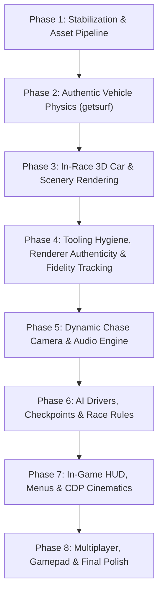

# Ignition (1997) Source Port Master Implementation Roadmap

## Native graphics entry points (2026-10-10)

[Graphics entry points](ghidra/windows_graphics_entry.md) now reconstruct Open,
Rebuild and Shutdown plus authentic sprite Open/Shutdown leaves. 525 differential
comparisons include 47 faults and 140 follow-ups; four paired native scenarios
execute real surface installation and lifecycle bodies with the original WndProc
reference boundary. Sprite lifecycle slots use real bodies, while allocating sprite
installation stays outside this native scope. The full workflow renews all 70
reconstructions and audit/exports pass at snapshot `5ed35d7ce096`. Next recover
native input shutdown, then independently resolve input-init repeat timing
arguments and real WinMain/WndProc/game dependencies. The playable standard
Windows game and native menus/render/input/audio/race validation remain incomplete.

## Native surface rebuild (2026-10-10)

[Surface rebuild](ghidra/windows_surface_rebuild.md), RVA0x5BD70, now implements
actual SDK release/create/palette behavior with real initialization/restoration.
Historical Close is renamed Rebuild. 360 comparisons include164 follow-ups,
43 faults and22 executed mutations. Three paired native windowed scenarios execute
two rebuilds plus production shutdown, proving record clearing while primary/type1
interfaces remain alive outside records. Both palette buffers are tracked separately.
Original WndProc is a reference boundary; native full game/startup/fullscreen/palette
and original compiler/link configuration remain open. Next recover sprite shutdown
and real graphics/WinMain dependencies. The focused DLL/host are not the rebuilt game.

## Native graphics resource shutdown (2026-10-10)

[Resource shutdown](ghidra/windows_surface_shutdown.md), RVA 0x5C060, now uses
actual SDK Release methods with verified mode-conditioned bank ordering. The
historical Reset name is corrected to Shutdown. 384 differential comparisons
include 173 follow-ups, 51 faults, 18 executed mutations and shared interfaces.
Four paired native constructor/shutdown scenarios use real interfaces, including
type2 bank boundaries, and preserve stale clipper/markers/geometry/HWND behavior.
The original WndProc remains a reference boundary; native full game/startup,
fullscreen/palette branches and original compiler/link layout remain open.
Next reconstruct surface rebuild RVA0x5BD70 and its caller dependencies.

## Native surface constructor (2026-10-10)

[Surface constructor](ghidra/windows_surface_open.md), RVA 0x5B740, has real C89
Win32/GDI/DirectDraw behavior and real initialization/restoration dependencies.
242 differential comparisons include 108 persistent follow-ups, four interface
faults and 37 executed mutation calls. Four paired native scenarios pass actual
API/COM execution: missing class and windowed 0/1/4 backbuffers, using authenticated
original WndProc as a reference boundary. This does not certify a rebuilt WndProc
or native game startup. Width/height/depth fields and real stdcall import libraries
are independently verified. Native fullscreen/lost-device, complete game behavior
and original compiler/link layout remain open. Next reconstruct actual display
resource shutdown/rebuild and then input/WinMain dependencies. The focused DLL
and probe remain validation artifacts.

This document defines the complete engineering roadmap and milestone plan for **Racing Dynamite**, the clean-room reverse engineering and modern C11/SDL2 source port of **Ignition** (1997, Unique Development Studios / Virgin Interactive), targeting standard Windows `IGN_WIN.EXE`, with `MAINDOS.EXE` retained as a secondary DOS reference.

---

## Surface lifecycle dependencies (2026-10-09)

[Surface lifecycle](ghidra/windows_surface_lifecycle.md) now reconstructs record
initialization RVA 0x56A40, configure RVA 0x5B730 and restoration RVA 0x5C730.
The 48-byte record layout and real SDK IsLost/Restore calls are verified; eight
record words remain opaque. Focused contracts pass 48/48/1,160 comparisons,
including 108 object/vtable faults, 106 callback mutation calls and persistent
initialization/restoration. COM replies are modeled in emulation. Native
DirectDraw/window/game parity, instruction equality and original compiler/link
layout remain open. Next recover complete Open/Close/Reset and authentic
WinMain/WndProc dependencies. The focused DLL is not a playable game.

## Persistent Windows execution roadmap (2026-10-09)

The persistent goal is a playable rebuilt standard Windows game with documented
native startup, menus, rendering, input, audio and representative races. Continue
across independently authenticated, validated and separately committed features.
The clean starting checkout was 169c493; local target fingerprint and live Ghidra
reachability pass. Active program selection is a user-provided assumption.

Current dependency path: pixel leaf 0x612A0 and storage 0x61530 are reconstructed;
byte/aligned free 0x5F8B0/0x61A60 add real release dependencies. Packing release 0x618B0 now has production C89 and 1,267 focused comparisons
with real free dependencies. String-copy 0x60480 now has production C89 and 941 focused comparisons, with
a documented Unicorn cross-page store limitation. Pointer-table growth
0x5F560 now has production C89 and 363 focused comparisons, with six distinct
controls verified statically. Complete ImageOp 0x61360 now has production C89
and 361 focused comparisons with coherent control and real helpers. Its shared
control backing also renews default initialization 0x611D0 and descriptor copying
0x612E0 coverage. HandleOp 0x5C830 now has production C89 and 150 focused comparisons with
real ImageOp descendants, persistent packed lifecycle and verified static
freelist/scratch/pool/cursor bindings. Primitive startup
0x5E610 now executes its real initialization dependencies. Rendering register-ABI blockers remain
in windows_triangle.md; pursue unblocked resource/platform work while resolving
a pure-C integration strategy. Native startup/presentation baseline and executable
linking, original toolchain evidence, input/audio, menus and race systems remain
open. Focused DLL/emulation evidence does not certify any of those milestones.

Primitive initialization now has eight production bodies and247 leaf/whole-chain
comparisons. The real dependency graph executes; only CRT malloc is modeled in
emulation. The production sine initializer also passes native Win32 comparison of
4096 entries under twelve masked x87 modes. This native evidence is restricted to
the sine routine, while full native primitive/heap/startup remains open. See
[primitive evidence](ghidra/windows_primitive_startup.md). Next recover native
surface initialization and its real Windows/DirectDraw dependencies. Original
toolchain/link layout, menus/render/input/audio/races and a playable rebuild remain
unverified; focused DLL, inventory labels and emulation do not certify those.

Protected originals, unrelated edits, tests/test_physics.c and the deleted
tools/dump_456470.py remain untouched. Each feature must retain existing suites,
check LF working/index bytes, update affected SQLite RVAs/evidence and generated
exports, pass workflow gates/hooks and commit before moving to the next feature.

## Active Windows Reconstruction Milestones (2026-10-07)

The [Windows decompilation plan](decomp_plan.md) governs current priorities:
fingerprint/import/ABI inventory and original runtime baseline; in-place
replacement of the DOS `decomp/`, build, and active tracking; one verified bounded
reconstruction; native
startup/UI/presentation; engine/race recovery; full-game validation and then SDL2
modernization. Compiler selection and Windows build/runtime verification remain
pending. DOS implementation progress is historical and must not carry over to
active Windows tracking. A parallel DOS implementation/build is out of scope.

The eight source-port phases below remain a long-term backlog, not evidence of
Windows completion or the immediate execution order. Their addresses, renderer
variants, constants, and parity claims require validation against `IGN_WIN.EXE`.

## 1. Project Vision & Architecture Principles

* **100% Behavioral Parity**: Vehicle handling, surface elevation query via `getsurf`, tire friction, AI spline navigation, and race timing must match the 1997 game exactly.
* **Authentic Software Renderer**: The primary rendering engine is a faithful recreation of UDS's "Lisa3D" software rasterizer producing authentic 8-bit paletted frames (`640x480` and `320x200`), with zero external 3D API dependencies.
* **Modern Portability**: Written in clean C11 using SDL2 for cross-platform windowing, framebuffer presentation, input polling, and audio streaming across Windows, Linux, and macOS.
* **Strict Clean-Room Separation**: No copyrighted assets are distributed with the code; assets are loaded dynamically from original game discs / GOG installs.
* **Mandatory Documentation**: Every binary format, engine subsystem, and reverse-engineered symbol is maintained under `docs/` in lockstep with the C codebase.

---

## 2. High-Level Subsystem Dependency Graph

---

## 3. Milestone Breakdown

### Phase 1: Stabilization & Asset Pipeline Fixes
**Objective**: Stabilize current test suites, fix asset extraction gaps, and document foundational formats.

1. **Test Suite Stabilization**:
   * Fix `tests/test_game_states.c` assertion for initial `ctx.show_waypoints`.
   * Ensure `test_formats` and `test_game_states` pass without warnings or failures.
2. **Asset Extraction Improvements**:
   * Update `tools/extract_assets.py` to allow `ENGINE.INF` files inside `CARS/*/SOUND/`, ensuring engine sound pitch curves are unpacked from `game.gog`.
3. **Foundational Documentation**:
   * Create `docs/formats/inf.md`: 800-byte `ENGINE.INF` structure (4 x 200-byte tables mapping speed to engine pitch and volume).
   * Create `docs/formats/pan.md`: 64KB raw $256 \times 256$ sky panorama format.
   * Create `docs/engine/architecture.md`: Master architectural overview, coordinate systems, memory layout, and timing model.

---

### Phase 2: Authentic Vehicle Physics & Surface Raycasting (`getsurf.c`)
**Objective**: Port the authentic vehicle physics simulation and surface raycast collision model.

1. **Surface Collision Reverse Engineering (`getsurf.c`)**:
   * Reverse-engineer `FUN_00412fc0` (`Surface_GetCell`) and `FUN_00413380` (`Surface_GetTriangleHeight`).
   * Document the complete raycast algorithm and triangle height interpolation in `docs/engine/surface_physics.md`.
2. **Vehicle Dynamics & Suspension Simulation**:
   * Port the 4-wheel independent raycast suspension model:
     * Independent wheel rays tested against active `.SRF` cells.
     * Spring-damper force calculation ($F_s = -k \cdot x - c \cdot v$).
     * Wheel normal and surface material friction coefficient query.
   * Reconstruct the `CarEntity` state structure (`0x484c` bytes per vehicle in `DAT_005daffc`).
   * Longitudinal traction model: engine torque curve from `ENGINE.INF`, acceleration, braking, reverse gear.
   * Lateral tire friction: slip angle, drifting, oversteer/understeer, grip recovery.
   * Angular dynamics: chassis pitch, roll, and yaw response to surface gradient and centrifugal forces.
   * Turbo boost mechanics: gauge accumulation, boost trigger, acceleration multiplier.
3. **Collision Detection & Response**:
   * Car-to-scenery collisions against `.PLC` obstacle bounding spheres and cylinders.
   * Car-to-car elastic impulse resolution (`FUN_00422680`).
   * Off-track detection (invalid cell index or off-road flag) and reset/penalty mechanics.
4. **Verification**:
   * Implement `tests/test_physics.c`: surface height matching against known track points, suspension equilibrium settling, acceleration and terminal velocity clamps.

---

### Phase 3: In-Race 3D Car & Dynamic Scenery Rendering
**Objective**: Render player and AI cars with articulated wheels, animate track scenery objects, and render horizon panoramas.

1. **Car Mesh Loading & 3D Instancing**:
   * Load `CARS/CARS.MSH`, `CARS/CARS.PLC`, and `CARS/CARS.TEX`.
   * Implement `Renderer_DrawCarMesh`:
     * Transform vehicle chassis submeshes by world position, pitch, roll, and yaw.
     * Steer front wheel submeshes according to current steering angle.
     * Spin all four wheel submeshes based on wheel angular velocity.
2. **Dynamic Scenery Animation (`.POS`)**:
   * Create `src/formats/pos.c` to parse `.POS` keyframe animation streams.
   * Implement `Pos_UpdateAnimatedObjects` (`FUN_004357a0`): advance animation playheads, interpolate translation and Euler rotation deltas, and transform animated track scenery (windmills, ships, blimps, bridges, boulders).
   * Update `docs/formats/pos.md` with full verification details.
3. **Horizon Sky Panorama (`.PAN`)**:
   * Implement background panorama blitter: sample 64KB `.PAN` textures with horizontal wrap based on camera yaw angle.
4. **Visual Effects & Particle Systems**:
   * Tire skid marks projected onto road triangles during drifting/braking.
   * Exhaust smoke and dust particles (`GENERAL/SMOKE.TEX`, `DARKSMOK.TEX`, `EXSMOKE.TEX`).
   * Turbo exhaust flames (`GENERAL/LIGHT.TEX`, `BOOM.TEX`).
   * Collision impact sprites.

---

### Phase 4: Tooling Hygiene, Authentic Multi-Backend Renderer & Fidelity Tracking (FCTS)
**Objective**: Clean and document the reverse engineering asset tools, preserve the authentic Lisa3D software rasterizer while architecting pluggable 3dfx/DirectX backends, implement granular per-category game fix controls, and establish machine-verifiable code fidelity against the fingerprinted Windows `IGN_WIN.EXE`.

1. **Prep Stage: Tools Audit, Pruning & Documentation**:
   * Audit all 50 Python scripts in `tools/`:
     * Group essential pipeline tools (`extract_assets.py`, `download_sdl2.py`, `pic_to_bmp.py`, `convert_all_pics.py`, `dump_font_sheets.py`, `dump_tex_bmp.py`, `decode_submesh_polys.py`, `ghidra_mcp/*`).
     * Group active verification tools (`verify_tab_formula.py`, `verify_all_game_strings.py`, `verify_screens.py`, `check_all_fonts.py`, `inspect_formats.py`).
     * Clean and prune obsolete, redundant scratch scripts (`test_austria_col.py`, `test_install_menucol.py`, `test_install_syscol.py`, `inspect_224.py`, `inspect_color_row.py`, `sample_tex.py`, `test_corrected_install.py`, `find_single_race.py`, etc.).
   * Create `tools/README.md` documenting every retained tool (purpose, dependencies, CLI arguments, inputs, and outputs).
2. **Renderer Authenticity & Pluggable Multi-Backend Architecture**:
   * **Authentic Software Rasterizer (Lisa3D)**:
     * Preserve 100% exact assembly parity with `lisa3d.c`: 8-bit paletted color mode (`640x480` and `320x200`), 6,000-bucket depth sorting, 16.16 fixed-point UV stepping, and authentic opcode dispatch (0x11, 0x12, 0x13, 0x15, 0x16, 0x17).
   * **Pluggable Multi-Backend Interface (`RendererBackend`)**:
     * Support runtime switching between:
       - `RENDERER_BACKEND_LISA3D_SOFTWARE`: Authentic software rasterizer.
       - `RENDERER_BACKEND_GLIDE_3DFX`: 3dfx Glide mode matching `IGN_3DFX.EXE` / Voodoo emulation.
       - `RENDERER_BACKEND_DIRECT3D`: Direct3D hardware rasterization matching `IGN_D3D.EXE`.
   * **Granular GFX Authenticity Toggles (`RendererOptions`)**:
     * In `Options > GFX Options`: resolution (640x480 vs 320x200), color depth (8-bit paletted vs 32-bit truecolor), UV precision (1997 fixed-point vs exact 1/W), and depth buffering (authentic buckets vs per-pixel Z).
3. **Granular Per-Category Game Fixes Subsystem**:
   * Replace monolithic fix toggle with `GameFixOptions` struct and bitmask:
     * `NO-CLIP / COLLISION`: mesh fall-through, barrier clipping, mountain climbing (`DEV-001`, `DEV-003`).
     * `SURFACE ELEVATION`: vehicle ground alignment, terrain floating/sinking (`DEV-002`).
     * `CAMERA & VIEWPORT`: right-handed camera basis, boundary clipping (`DEV-004`).
     * `AI NAVIGATION`: spline boundary transition traps.
     * `AUDIO & SOUND`: high-RPM pitch curve cutoff.
     * `RENDERER GLITCHES`: polygon sorting flickering and texture bleeding.
   * Expand `Options > Gameplay > Game Fixes` menu with independent category toggles and quick presets: `1997 AUTHENTIC` (all OFF) and `APPLY ALL FIXES` (all ON).
4. **Fidelity Tracking Infrastructure & Code Provenance**:
   * Create `docs/tracking/fidelity_strategy.md` defining inline Doxygen provenance tags (`@original`, `@fidelity`, `@deviation`, `@fix_category`, `@notes`).
   * Create `docs/tracking/deviations.md` cataloguing every authentic divergence with original address, bug analysis, port solution, and category toggle key.
   * Create root `CHANGELOG.md` following the Keep a Changelog standard.
   * Update `docs/ghidra/functions.md` with fidelity ratings (`EXACT`, `ADAPTED`, `EXTENDED`) and direct source file links.
5. **Automated Fidelity Verification Tooling (`tools/verify_fidelity.py`)**:
   * Implement automated audit script validating code annotations against `functions.md` and `deviations.md`.
   * Add `verify_fidelity` test target to CMake/CTest to guarantee parity in continuous integration.

---

### Phase 5: Dynamic Chase Camera & Audio Subsystem
**Objective**: Recreate the iconic Ignition chase cameras and the complete sound and music engine.

1. **Dynamic Racing Chase Camera**:
   * Implement authentic follow camera in `src/renderer/camera.c`:
     * Dynamic target lookahead along velocity/heading vector.
     * Smooth spring-damper position and azimuth lag.
     * Automatic elevation and pitch adaptation on steep hills and jumps.
     * Camera view modes: Classic Isometric (authentic default), Close Chase, Far Chase, Bumper View.
2. **Audio Subsystem (`src/audio/`)**:
   * DirectSound emulation using SDL2 Audio callback and custom 16-channel software mixer.
   * Sound effect pool loaders:
     * General sounds (`GENERAL/SOUND/`): `ROLL`, `SKID`, `COLL`, `BOOST`, `DIV`.
     * Track-specific ambient sounds (`LEVELS/<TRACK>/SOUND/`).
     * Car-specific engine sounds (`CARS/<CAR>/SOUND/00_A.WAV`, `01_A.WAV`).
   * Real-time engine RPM pitch modulation using `ENGINE.INF` curve tables.
   * 3D spatial panning and volume attenuation for opponent vehicles.
   * Redbook CD-DA soundtrack streaming: seamless looping playback of `assets/MUSIC/Track02.ogg` through `Track08.ogg` matched to active circuit.
   * Write comprehensive documentation in `docs/engine/audio.md`.

---

### Phase 6: AI Opponent Drivers, Checkpoints & Race Rules
**Objective**: Build a complete, competitive racing experience with split-time checkpoints and intelligent opponents.

1. **Checkpoint & Lap Tracking Subsystem**:
   * Parse type `150..154` checkpoint trigger gates from track `.PLC` files.
   * Implement `Race_CheckCheckpointTriggers` (`0x00429a40`):
     * Detect gate line crossings using 2D line segment intersection.
     * Validate driving direction and trigger "WRONG WAY" warning when driving backwards.
     * Sector split-time computation and delta comparison against best lap.
     * Lap counter progression (standard 3-lap races), best lap tracking, total race clock.
     * Real-time leaderboard ranking (1st to 6th place) based on lap count, checkpoint index, and distance along the spline ribbon.
2. **AI Opponent Driving Simulation**:
   * Implement `AI_FollowTrackSplines` (`FUN_004134e0`):
     * Pursue target nodes along the centerline ribbon extracted from `.TRI`.
     * Calculate track curvature ($\kappa = \Delta\text{heading} / \Delta\text{distance}$) to regulate speed and initiate braking before turns.
     * Lateral lane selection, overtaking logic, and dynamic avoidance of other vehicles.
     * Difficulty tiers (Novice, Amateur, Pro) adjusting engine power, mass, and catch-up rubber-banding.
3. **Race Lifecycle & Event State Flow**:
   * Starting grid countdown sequence ("READY... STEADY... GO!").
   * Checkered flag, finish line triggers, victory sequence, and end-of-race results table.

---

### Phase 7: In-Game HUD, Menus & CDP Cinematics
**Objective**: Recreate authentic 2D user interfaces, HUD overlays, and FMV video decoding.

1. **2D In-Game HUD Overlays**:
   * Implement `src/ui/hud.c` using authentic bitmap lettering (`.LFT`) and graphics (`N_SYSGFX.PIC`):
     * Speedometer dial and digital speed readout.
     * Turbo boost gauge (filling and depleting).
     * Current position indicator badge (1st - 6th).
     * Lap indicator ("LAP 1/3") and race stopwatch.
     * Sector split-time popup (+1.2s, -0.4s).
     * Minimap displaying track spline outline and vehicle dots.
2. **Interactive Menu System**:
   * Expand `src/core/game_state.c`:
     * Car Select screen: vehicle stats, color schemes, and 3D rotating preview car (`MENUCAR.MSH` / `MENUCAR.TEX`).
     * Track Select screen: circuit preview image (`.PIC`), track records, and difficulty indicators.
     * Options Menu: key rebinding, controller assignment, sound and music volume sliders, screen resolution toggle.
     * Championship Mode: multi-race season points scoring, podium presentations, and secret car/track unlocks.
     * In-race pause menu and post-race standings.
3. **CDP Intro Video Cinematics**:
   * Implement `src/formats/cdp.c`: decode `"CDP\0"` header, frame headers, embedded palette, and delta-skip RLE decompression (`FUN_00499abc`).
   * Play developer and publisher intro animations (`assets/BALTAZAR/DATA/IGN*.CDP`) seamlessly on startup.

---

### Phase 8: Multiplayer, Gamepad Support & Final Polish
**Objective**: Modern platform enhancements, split-screen gameplay, and reverse-engineering database completeness.

1. **Controller & Gamepad Integration**:
   * Support `SDL_GameController` with analog steering, analog trigger throttle/braking, and vibration/rumble feedback.
2. **Two-Player Local Split Screen**:
   * Horizontal and vertical split-screen viewports with independent chase cameras and audio listener positioning.
3. **Widescreen & High-Refresh Support**:
   * Proper aspect-ratio correction for 16:9 and 21:9 monitors while maintaining crisp 8-bit software rendering.
   * Frame interpolation / uncoupled physics tick for smooth high-refresh (120Hz / 144Hz / 240Hz) displays.
4. **Reverse Engineering Completeness**:
   * Ensure all identified functions, memory addresses, and structures in `IGN_WIN.EXE` are completely catalogued with verified Windows provenance in `docs/ghidra/functions.md`, `globals.md`, and `structs.md`.

---

## 4. Verification & Quality Assurance Strategy

| Category | Verification Method | Pass Criteria |
| :--- | :--- | :--- |
| **Asset Formats** | Automated unit tests (`./build/test_formats`) | 100% pass across all 7 tracks and all cars. |
| **State Machine** | Headless automated runner (`./build/test_game_states`) | All state transitions, palette switches, and frame renders pass cleanly. |
| **Physics Simulation** | Physics test harness (`./build/test_physics`) | Surface raycast elevations match `.SRF` grid; suspension settles to equilibrium; vehicle top speeds match original specs. |
| **Spline Waypoints** | Spline test suite | Continuous closed-loop chaining across all circuits without breaks. |
| **Audio Engine** | Audio loopback verification | SFX and music stream concurrently without clipping, buffer underruns, or memory leaks. |
| **Full Race Loop** | Interactive playtesting | Complete a full 3-lap race on every circuit with 5 AI opponents, working HUD, camera, sound, and finish line results. |
| **Windows Runtime Parity** | Controlled original/rebuilt comparison | Behavioral and visual parity against the fingerprinted `IGN_WIN.EXE` in the same documented Windows-compatible environment; instruction/binary matching reported separately. |
