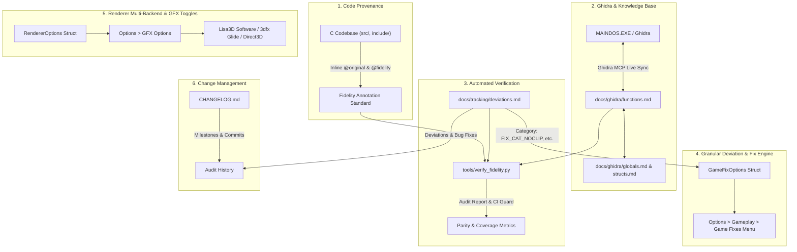

# Fidelity & Change Tracking System (FCTS) Master Specification & Implementation Plan

This document provides the complete technical specification, architectural blueprint, and execution roadmap for **Phase 4: Tooling Hygiene, Authentic Multi-Backend Renderer & Fidelity Tracking (FCTS)** of **Racing Dynamite** (Ignition 1997 source port).

---

## 1. Overview & Problem Statement

In reverse engineering and source porting **Ignition (1997)** (`MAINDOS.EXE` / `MAINDOS.EXE`), maintaining strict fidelity to the original assembly code while adapting the engine for modern platforms (C11, SDL2, 64-bit portability) is paramount.

This system addresses five critical challenges:
1. **Tooling Hygiene & Documentation Gap**: The `tools/` directory contains 50 Python scripts that are undocumented, with several obsolete or redundant scratch scripts from initial reverse engineering exploration.
2. **Renderer Authenticity & Pluggable Backends**: Preserving the authentic 1997 "Lisa3D" software rasterizer (8-bit paletted color, depth-bucketing, 16.16 fixed-point math, opcode dispatch) exactly as it worked in the original game, while providing an architecture to toggle between Software, 3dfx Glide (`IGN_3DFX.EXE`), and Direct3D (`IGN_D3D.EXE`) modes.
3. **Granular Per-Category Game Fixes**: Moving away from a coarse "ON/OFF" switch so players can independently toggle specific bug fix categories (No-Clip/Collision, Surface Elevation, Camera Glitches, AI Navigation, Audio).
4. **Code Provenance & Traceability**: Binding every C function, struct, and constant directly to its assembly address in `MAINDOS.EXE` with standardized Doxygen provenance headers.
5. **Change Tracking & Deviation Registry**: Maintaining an immutable record of each change, bug fix, and architectural deviation.

---

## 2. Master Subsystem Architecture



---

## 3. Phase Breakdown & Execution Stages

### Stage 0: Prep Stage — Tools Audit, Pruning & Documentation

> [!IMPORTANT]
> **This prep stage is executed first before modifying engine or renderer code.**

#### 1. Audit of 50 Tools in `tools/`:
* **Category A: Essential Pipeline Tools (Retain & Document)**:
  * `extract_assets.py`: Unpacks game data from CD / GOG `game.gog` / cue/bin.
  * `download_sdl2.py`: Fetches SDL2 development libraries.
  * `pic_to_bmp.py`, `convert_all_pics.py`: Converts `.PIC` images with embedded/external palettes.
  * `dump_font_sheets.py`, `ascii_art_font.py`: Extracts and renders `.LFT` font glyphs.
  * `dump_tex_bmp.py`: Exports 1024x1024 `.TEX` sheets and 64KB pages to BMP.
  * `decode_submesh_polys.py`: Analyzes submesh polygon headers and material IDs.
  * `tools/ghidra_mcp/*`: Ghidra MCP server bridge and plugins for live reverse engineering.

* **Category B: Active Verification Tools (Retain & Document)**:
  * `verify_tab_formula.py`: Verifies mathematical formula for `.TAB` shading matrix.
  * `verify_all_game_strings.py`: Validates string offsets against executable.
  * `verify_screens.py`: Verifies menu screen layouts and resolutions.
  * `check_all_fonts.py`: Scans all font files for header validity.
  * `inspect_formats.py`, `inspect_track_files.py`: General format health checks.

* **Category C: Obsolete / Redundant Scratch Scripts (Prune & Delete)**:
  * Redundant palette inspection scripts superseded by test suites: `test_austria_col.py`, `test_install_menucol.py`, `test_install_syscol.py`, `inspect_224.py`, `inspect_color_row.py`.
  * Superseded exploratory scripts: `sample_tex.py`, `test_corrected_install.py`, `find_single_race.py`, `check_install_hdr.py`.

#### 2. Deliverable: `tools/README.md`:
* Complete reference manual detailing purpose, CLI arguments, inputs, outputs, and usage instructions for every retained script.

---

### Stage 1: Fidelity & Change Tracking Infrastructure

#### 1. `docs/tracking/fidelity_strategy.md`
Master guideline defining code provenance, commit conventions, and verification steps.

##### Standardized Inline Provenance Header:
```c
/**
 * @brief Raycasts world coordinate (X, Z) against track surface collision grid.
 * @original FUN_00412fc0 (MAINDOS.EXE @ 0x00412fc0, getsurf.c)
 * @fidelity ADAPTED
 * @deviation DEV-001 (Boundary safety clamp preventing off-track crash)
 * @fix_category FIX_CAT_NOCLIP
 * @notes Uses 50 * 512 unit coordinate offset matching DAT_00479c48.
 *
 * @param srf Loaded surface data
 * ...
 */
bool Surface_Raycast(const SrfData *srf, ...);
```

##### Fidelity Classification Levels:
* **`EXACT`**: 100% 1:1 algorithmic and mathematical equivalence with decompiled assembly (same formulas, constants, coordinate conventions).
* **`ADAPTED`**: Authentic logic preserved, but adapted for modern C11/SDL2 (e.g. replacing DirectDraw blit with SDL surface, libc file IO, endian-safe unpacking).
* **`EXTENDED`**: Core logic faithfully matches original, plus enhancements (e.g. out-of-bounds guards, telemetry hooks, widescreen aspect ratio corrections).
* **`INFRASTRUCTURE`**: Modern engine scaffolding not present in the 1997 binary (e.g. logging subsystem, SDL input mapper, CMake, unit test harnesses).

#### 2. `docs/tracking/deviations.md`
Formal register of every intentional divergence from `MAINDOS.EXE`:
* **ID**: `DEV-001`, `DEV-002`, etc.
* **Category**: e.g., `FIX_CAT_NOCLIP`
* **Original Address & Assembly**: Exact disassembly and decompilation from `MAINDOS.EXE`.
* **Original Bug / Limitation**: Why it failed in 1997 (e.g., out-of-bounds array read in Austria, mesh clipping).
* **Source Port Implementation**: How Racing Dynamite handles it.
* **Menu Toggle Key**: The option struct flag controlling it.

#### 3. `CHANGELOG.md`
Root repository changelog following the [Keep a Changelog](https://keepachangelog.com/) standard:
* Tracks `[Unreleased]` and versioned releases.
* Sections: `Added`, `Changed`, `Fixed`, `Reverse Engineered`, and `Deviations`.

#### 4. `AGENTS.md`
Update project rules with mandatory provenance annotations, commit standards, and fidelity verification.

---

### Stage 2: Renderer Authenticity & Pluggable Multi-Backend Architecture

#### 1. Pluggable Multi-Backend Interface (`RendererBackend`)
```c
typedef enum {
    RENDERER_BACKEND_LISA3D_SOFTWARE = 0, // Authentic 1997 UDS Lisa3D software rasterizer
    RENDERER_BACKEND_GLIDE_3DFX      = 1, // 3dfx Glide mode (IGN_3DFX.EXE / Voodoo emulation)
    RENDERER_BACKEND_DIRECT3D        = 2  // Direct3D hardware acceleration (IGN_D3D.EXE)
} RendererBackendType;

typedef struct {
    RendererBackendType backend_type;
    
    // Granular Software / Lisa3D Authenticity Toggles
    bool authentic_fixed_point_uv; // 16.16 fixed point UV stepping vs exact floating point
    bool authentic_depth_buckets;  // 6,000 depth buckets vs floating point Z-buffer
    bool authentic_dithering;      // 1997 Lisa3D dither matrix
    bool force_8bit_paletted;      // Authentic 8bpp color lookup vs 32-bit RGBA
    bool render_panoramas;         // 64KB cylindrical horizon background blitting
    
    // Resolution mode
    int  internal_width;           // 640 or 320
    int  internal_height;          // 480 or 200
} RendererOptions;
```

#### 2. Preserving Exact Software Rasterizer Fidelity
* Software rasterizer code (`src/renderer/rasterizer.c`) preserves 100% exact assembly parity with `lisa3d.c`:
  * Opcode 0x11 (unshaded textured triangle)
  * Opcode 0x12 (color-key 0 cutout triangle)
  * Opcode 0x13 (alpha/shadow blended triangle using `.SHD`)
  * Opcode 0x15 (perspective textured triangle)
  * Opcode 0x16 (transparent cutout variant)
  * Opcode 0x17 (Gouraud shaded shadow triangle)
* When `authentic_fixed_point_uv` and `authentic_depth_buckets` are active, the rasterizer operates identical to `MAINDOS.EXE`.

#### 3. GFX Options UI Integration
* Submenu: `Options > GFX Options`:
  * `RENDERER`: `[LISA3D SOFTWARE]` / `[3DFX GLIDE]` / `[DIRECT3D]`
  * `RESOLUTION`: `[640x480 HI-RES]` / `[320x200 LO-RES]`
  * `COLOR DEPTH`: `[AUTHENTIC 8-BIT]` / `[32-BIT TRUECOLOR]`
  * `UV PRECISION`: `[1997 FIXED-POINT]` / `[ACCURATE 1/W]`
  * `Z-BUFFERING`: `[AUTHENTIC BUCKETS]` / `[PER-PIXEL Z]`

---

### Stage 3: Granular Game Fixes Architecture

#### 1. Per-Category Fix Configuration (`GameFixOptions`)
```c
typedef enum {
    FIX_CAT_NOCLIP        = (1 << 0), // Prevent mesh fall-through, barrier clipping, mountain climbing (DEV-001, DEV-003)
    FIX_CAT_ELEVATION     = (1 << 1), // Prevent vehicle floating/sinking due to ground alignment (DEV-002)
    FIX_CAT_CAMERA        = (1 << 2), // Fix right-handed camera basis and boundary clipping (DEV-004)
    FIX_CAT_AI_PATHING    = (1 << 3), // Prevent AI getting stuck on spline boundaries
    FIX_CAT_AUDIO         = (1 << 4), // Fix high-RPM pitch curve cutoff
    FIX_CAT_RENDERER      = (1 << 5), // Fix polygon sorting flickering and texture bleeding
} GameFixCategory;

typedef struct {
    bool fix_noclip;       // [FIXED] / [AUTHENTIC BUGGY]
    bool fix_elevation;    // [FIXED] / [AUTHENTIC BUGGY]
    bool fix_camera;       // [FIXED] / [AUTHENTIC BUGGY]
    bool fix_ai_pathing;   // [FIXED] / [AUTHENTIC BUGGY]
    bool fix_audio;        // [FIXED] / [AUTHENTIC BUGGY]
    bool fix_renderer;     // [FIXED] / [AUTHENTIC BUGGY]
} GameFixOptions;
```

#### 2. Interactive UI (`Options > Gameplay > Game Fixes`)
* Menu items:
  1. `COLLISION & NO-CLIP: [FIXED] / [AUTHENTIC BUGGY]`
  2. `SURFACE ELEVATION:  [FIXED] / [AUTHENTIC BUGGY]`
  3. `CAMERA & VIEWPORT:   [FIXED] / [AUTHENTIC BUGGY]`
  4. `AI NAVIGATION:       [FIXED] / [AUTHENTIC BUGGY]`
  5. `AUDIO & SOUND:       [FIXED] / [AUTHENTIC BUGGY]`
  6. `RENDERER GLITCHES:   [FIXED] / [AUTHENTIC BUGGY]`
  7. `PRESET: 1997 AUTHENTIC` (Disables all fixes for authentic retro quirks)
  8. `PRESET: APPLY ALL FIXES` (Enables all recommended fixes)
  9. `BACK`

---

### Stage 4: Automated Parity & Verification Tooling (`tools/verify_fidelity.py`)

#### 1. Script Capabilities
* Scans all `.c` and `.h` files in `src/` and `include/`.
* Parses `docs/ghidra/functions.md` and `docs/tracking/deviations.md`.
* Automated checks:
  1. Validates that every ported function in `functions.md` exists with matching `@original` tag in C code.
  2. Flags any C function with `@original` pointing to an unlisted or mismatched address.
  3. Detects unannotated functions in `src/`.
  4. Validates all `@deviation DEV-XXX` references match entries in `docs/tracking/deviations.md`.
  5. Validates that every deviation has an assigned `fix_category`.
* Generates **Parity & Fidelity Report**:
  * Total Tracked Functions
  * Identified / Analyzed / Ported / Verified percentages
  * Subsystem breakdown (Physics, Lisa3D Renderer, Formats, State Machine, Audio).

#### 2. CMake & CTest Integration
* Add `verify_fidelity` test target to CMake so `ctest` runs the fidelity audit alongside unit tests.

---

## 4. Verification Plan

### Automated Tests
1. `uv run python -m py_compile tools/*.py` (All retained tools validate cleanly).
2. `uv run python tools/verify_fidelity.py` (Fidelity verification passes with 0 errors).
3. `ctest --test-dir build --output-on-failure` (All C unit tests and fidelity test pass).

### Manual Verification
1. Test toggling each category independently in `Options > Gameplay > Game Fixes`.
2. Test "1997 Authentic" and "Apply All" presets.
3. Test toggling renderer backends and precision switches in `Options > GFX Options`.
4. Verify `tools/README.md` and `docs/tracking/deviations.md` are complete and accurate.
